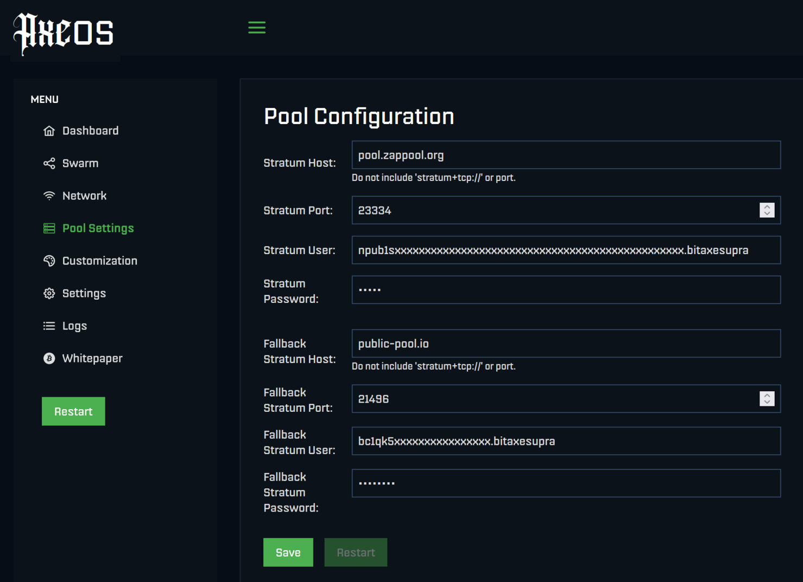

# HowTo

## Prerequisites

A working Bitaxe, or similar home miner.

A Nostr account, that can receive zaps / lightning payments (with an associated lightning address, "lud16", settable in almost all Nostr clients).


## Setup

### Open the __Pool Config__ page of your Bitaxe

### Set the following parameters:

```
Stratum Host:      pool.zappool.org
Stratum Port:      23334
Stratum User:      Put your Nostr npub here!
Stratum Password:  Put anything (e.g. 12345)
```

Example:



Note: when typing, watch out for the double-P and double-O in "zappool".

Note: other miners may require the stratum server in this format:

```
stratum+tcp://pool.zappool.org:23334
```

### Set the Fallback host

Set a fallback server, e.g. your previously used server, for the case whan Zappool is not available.

### __Save__ the changes

### __Restart__ the miner

## Verify

### Check the __Dashboard__

Open the dashboard of the Bitaxe.

There should be no warning about unreachable stratum server.

15-30 minutes after setup, the number of Shares found should go up to a few.
([Why so long?](./faq#why-does-it-take-so-long-to-find-a-work-share))

### Check your Lightning wallet

After one day, check the lightning wallet connected to the used Nostr account.

