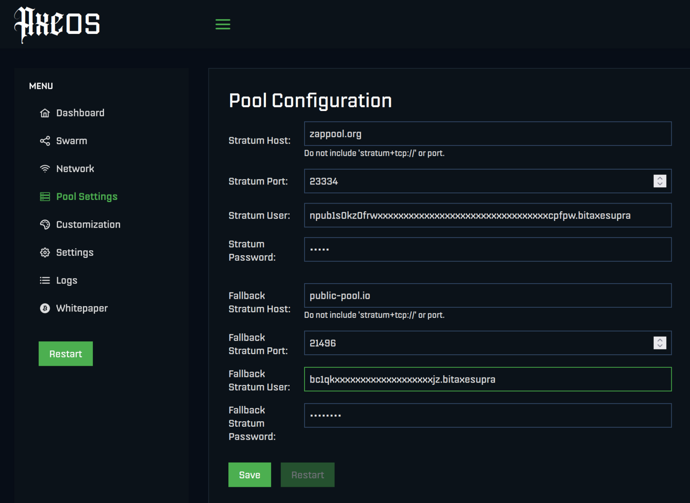

# HowTo

## Prerequisites

A working BitAxe, or similar home miner.

A Nostr account, that can receive zaps / lightning payments (with an associated lightning address, "lud16", settable in almost all Nostr clients).


## Setup

### Open the __Pool Config__ page of your BitAxe

### Set the following parameters:

```
Stratum Host:   zappool.org
Stratum Port:   23334
Stratum User:   Put your Nostr npub here!
```

Example:



### Set the Fallback host

Set a fallback server, e.g. your previously used server, for the case whan Zappool is not available.

### __Save__ the changes

### __Restart__ the miner

## Verify

### Check the __Dashboard__

Open the dashboard of the BitAxe.

There should be no warning about unreachable stratum server.

15-30 minutes after setup, the number of Shares found should go up to a few.
([Why so long?](./faq#why-does-it-take-so-long-to-find-a-work-share))

### Check your Lightning wallet

After one day, check the lightning wallet connected to the used Nostr account.

