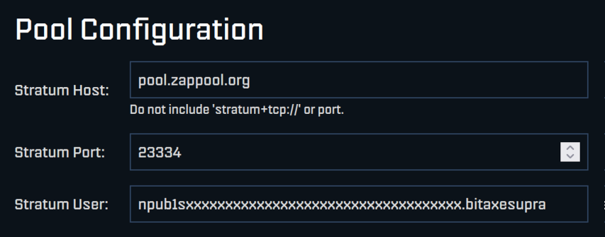

# Quick Start

Setting up Zappool is very simple: you need to set the pool params in your BitAxe, with your Nostr ID, and then you will get your daily mined sats to your lighting address!


## What you need:

- A working BitAxe (or other similar home mining device)
- A Nostr account that can receive lightning payments/zaps


## Setup:

```
Stratum Host:   pool.zappool.org
Stratum Port:   23334
Stratum User:   Put your Nostr npub here!
```

Example:



For more details (on Nostr identity, verifying the setup, device names. etc.).
see [Howto](howto#setup)


## What to expect?

You should get a lightning payment with the mined sats daily! A typical rate for a BitAxe is 30-50 sats daily.

See the [FAQ](/faq) for more details.
